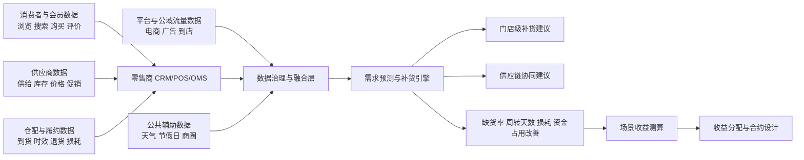

# 零售行业全渠道智能补货第二周研究交付包方案

## 交付物清单与验收标准

本方案以实验室任务书对 Week 2“深入研究、收集案例与数据”的要求为对齐基准，同时延续你第一周已经收敛出的“零售行业—以全渠道智能补货为核心场景”的研究主线。任务书明确要求报告、可视化网站与开源发布三项最终成果，因此第二周最合理的定位不是“再写一篇综述”，而是产出一套**足以支撑第三周成稿与第四周网站发布**的研究中间件。fileciteturn0file0 fileciteturn0file1

| 文件名 | 格式 | 本周用途 | 验收标准 |
|---|---|---|---|
| `00_Executive_Summary_Week2.pdf` | PDF | 给导师快速看结论 | 1页；能在 3 分钟内说明研究范围、主案例、核心发现、主要风险；至少包含 3 条有出处的关键判断 |
| `01_Week2_Research_Progress_Report.pdf` | PDF | 阶段性主报告 | 6–8 页；必须覆盖资产地图、数据流与主体、3 个案例、收费模式、估值原型、收益分配、风险与下周验证任务 |
| `02_Case_Study_Cards.xlsx` | Excel | 案例卡库 | 至少 3 个深挖案例；每个案例含角色定位、数据来源、产品形态、使用场景、收益指标、交易/收费模式、证据可信度、需补充项 |
| `03_Retail_Data_Asset_Evidence_Base.xlsx` | Excel | 可追溯证据库 | 至少含 `Policy_and_Regulation`、`Cases`、`Metrics`、`Claims_Checklist` 四个 Sheet；每条关键结论可回溯到出处 |
| `04_Valuation_and_Revenue_Sharing_Prototype.pdf` | PDF | 方法原型 | 3–4 页；含公式、变量解释、一组可运行数值示例、分配因子与初始权重，并明确标注“研究假设” |
| `05_Dashboard_Wireframe.html` | HTML | 网站原型 | 至少 4 个区块：资产地图、数据流与主体、案例对比、估值计算器；移动端可读、可继续开发为 GitHub Pages |
| `05_Dashboard_Wireframe.svg` | SVG | 线框图静态稿 | 可直接嵌入 README 或网站；与 HTML 原型结构一致 |
| `06_Week3_Verification_Plan.md` | Markdown | 下周工作清单 | 按优先级列出合同样本、访谈、量化数据点、价格核验、网站实现等任务 |
| `README.md` | Markdown | 仓库说明 | 交代项目背景、研究问题、方法、文件结构、引用规范、网站预览说明 |

**建议的导师验收口径**可以很直接：如果第二周交付包能够回答“主场景是什么、证据从哪里来、为什么这样估值、下一周还缺什么”，那就合格；如果只能回答“我又继续搜了很多资料”，那就还停留在第一周。这个判断标准与任务书对“研究深度、内容质量、完成度”的评估逻辑一致。fileciteturn0file0

## 执行摘要

本周交付应聚焦“**零售行业数据资产估值与收益分配——以全渠道智能补货为核心场景**”，并采用“**一个主案例 + 两个对照案例 + 一个估值原型 + 一个证据库**”的方式推进。原因是：公开资料中，零售数据产品的**业务成效**披露明显多于**合同价格**披露，因此第二周不应强行编造数据产品报价，而应先把收费方式、价值形成逻辑、收益分配因子、关键量化指标和证据链搭牢。官方政策已经给出清晰边界：数据流通要以安全、合规、可追溯为前提，《数据二十条》要求探索数据资源持有权、数据加工使用权、数据产品经营权的结构性分置；公共数据用于产业发展、行业发展场景时可以有条件有偿使用；数据交易场所应披露适用范围、更新频率和计费方式，并探索价值评估指标体系；可信数据空间则鼓励按“市场评价贡献、贡献决定报酬”形成动态价值评估和分配机制。结合这些制度约束与国家数据局发布的零售案例，第二周最稳妥的交付方式是：以**全球蛙智能补货/供应链优化**为主案例，辅以**瓴羊天攻智投**验证“多方数据 + 场景服务 + 持续盈利”的数据产品模式，再以**京东库存配置与选品分配工业化论文**作为补货算法与量化收益的对照证据，形成可被导师评审、也可直接转入第三周写作和网站开发的研究包。citeturn5view0turn13view0turn15view2turn18view1turn14view2turn23view0turn23view1turn30academia0

## 阶段性研究报告结构化内容

建议把 `01_Week2_Research_Progress_Report.pdf` 控制在 **7 页**，刚好落在“6–8 页”的要求区间内。结构上不追求面面俱到，而是让每一页都服务于第三周成稿。

### 建议页结构

| 页码 | 章节标题 | 本页必须回答的问题 | 关键证据 |
|---|---|---|---|
| 封面 | 标题、作者、时间、核心场景 | 研究的边界是什么 | 任务书与 Week 1 选题收口 fileciteturn0file0 fileciteturn0file1 |
| 第 1 页 | 研究目标与执行摘要 | 为什么是“全渠道智能补货”而不是泛零售数据 | 国家数据局零售案例、全国数据资源调查 citeturn23view0turn4view0 |
| 第 2 页 | 数据资产地图 | 这个场景里有哪些数据、分别掌握在谁手里 | 《数据二十条》、PIPL、数据安全法 citeturn5view0turn6view0turn36view0 |
| 第 3 页 | 数据流与主体关系 | 数据如何从原始资源转成补货建议和服务收益 | 可信数据空间行动计划、全球蛙案例 citeturn14view2turn23view0 |
| 第 4 页 | 三案例对比 | 市场上有哪些可比做法，公开披露到什么程度 | 全球蛙、瓴羊、京东论文 citeturn23view0turn23view1turn30academia0 |
| 第 5 页 | 交易与收费模式 | 当前价格为什么难直接拿到，替代性证据是什么 | 深圳数据交易办法、公共数据定价通知、流通服务机构意见 citeturn18view1turn15view2turn17view0 |
| 第 6 页 | 估值与收益分配原型 | 如何把业务指标转成数据产品收益，再转成各方分成 | 财政部数据资产指导意见、Data Shapley、FedValue citeturn31view2turn9academia0turn10academia0turn10academia3 |
| 第 7 页 | 风险、未决问题、Week3 计划 | 哪些已有高证据，哪些仍是假设，下一周怎么补证 | 证据库与风险清单本身 |

### 这份阶段性报告应该突出什么

第一，要明确说明**主场景是“补货”而不是“零售数字化”**。国家数据局发布的全球蛙案例已经给了一个非常适合 Week 2 的主证据：企业基于消费者授权行为数据和商户授权的供应、物流、价格、销售、库存等数据，开发出智能补货、供应链优化和协同服务，并公布了转化率、客单价、整体销售额、库存周转和库存成本等量化成效。和泛泛谈“会员画像很重要”相比，这种场景更容易直接落到估值。citeturn23view0

第二，要明确承认一个现实：**公开资料对价格披露不充分，但对收费方式和价值形成逻辑披露相对充分**。深圳的数据交易规则要求交易标的披露适用范围、更新频率、计费方式等信息，并把交易标的区分为数据产品、数据服务和数据工具，同时要求从数据质量、样本一致性、计算贡献和业务应用等维度探索估值指标体系。国家发展改革委和国家数据局关于公共数据授权运营价格形成机制的通知，则把“最高准许收入—上限收费标准—运营机构具体收费标准”的定价链路说清楚了。也就是说，导师更容易接受你本周先把**收费逻辑**和**估值逻辑**讲透，而不是硬写一个并无官方公开依据的报价数字。citeturn18view1turn15view2

第三，要把数据要素研究与实验室方向对齐到“**估值 + 分配**”。财政部关于加强数据资产管理的指导意见明确提出，要探索数据资产收益分配与再分配机制，并按照“谁投入、谁贡献、谁受益”维护相关主体权益；可信数据空间行动计划则进一步提出“探索构建动态数据价值评估模型，按照市场评价贡献、贡献决定报酬的原则分配收益”。这正好给你的 Week 2 原型提供制度背书。citeturn31view2turn14view2

### 可直接嵌入报告的数据流 Mermaid 图



## 三个深挖案例与标准化案例卡

本周建议采用“**一个主案例 + 两个对照案例**”的证据设计。这样既能保证主题聚焦于智能补货，又能解释市场上为什么大量零售数据产品采用“持续服务、项目制、平台制、分成制”的复合收费逻辑。下面的案例卡字段可以直接搬进 `02_Case_Study_Cards.xlsx`。公开资料显示，国家数据局发布的零售案例更注重**成效披露**而非**合同金额披露**，因此案例卡中必须单独加上“证据可信度”和“需补充项”。citeturn23view0turn23view1turn17view0turn18view1

### 案例卡表头模板

| 案例名称 | 案例类型 | 角色定位 | 数据来源 | 产品形态 | 使用场景 | 可量化收益指标 | 交易/收费模式 | 公开证据 | 证据可信度 | 需补充项 |
|---|---|---|---|---|---|---|---|---|---|---|

### 填充后的三张案例卡

| 案例名称 | 案例类型 | 角色定位 | 数据来源 | 产品形态 | 使用场景 | 可量化收益指标 | 交易/收费模式 | 公开证据 | 证据可信度 | 需补充项 |
|---|---|---|---|---|---|---|---|---|---|---|
| 山西全球蛙海量消费数据赋能传统零售业转型升级 | 主案例 | 零售数据服务商，面向连锁商超输出智能补货与供应链优化能力 | 消费者授权的浏览、搜索、购买、评价数据；与合作商户协议获取的供应商库存、物流、价格、零售商销售与库存动态；经清洗整合后形成覆盖 30 省份、超 100TB 数据资源 | 智能补货、市场洞察、供应链优化、供应链协同服务 | 全渠道补货、品类优化、上下游协同 | 客户转化率 +15pct，客单价 +10%，整体销售额 +15%，库存周转效率 +30%，节省库存成本约 2000 万元；订单处理时间平均缩短 15%，每日处理订单量 +20%，采购到销售周期缩短 20%，资金使用效率提升近 33%，协同效率提升 40%+ | 公开材料未披露合同单价；从产品形态看，更接近 SaaS + 项目服务 + 持续运营的复合收费模式 | 国家数据局典型案例 citeturn23view0 | 高 | 需补：合同样本、报价页、是否按门店数/调用量收费 |
| 瓴羊天攻智投 | 对照案例 | 零售/商贸营销数据平台，验证多方数据融合与持续服务盈利逻辑 | 户外广告、线下售点、电商行为等多方数据源，经治理形成 50PB 数据集、覆盖 191 个行业和 300+ 指标 | 场景化数据集、潜客圈选、点位优选、预算分配、投后分析、可信数据空间服务 | 零售营销、客群定位、媒体投放优化 | 户外广告投放效果提升 41%；已服务超 300 家广告主、近 100 亿累计广告投放规模、1400 万户外广告位数字化服务 | 官方明确为“自营 + 平台”双轨盈利模式；符合“平台服务费 + 技术服务费 + 生态协同收益”的逻辑 | 国家数据局优秀项目案例 citeturn23view1 | 高 | 需补：不同客户的计费口径、是否存在效果分成 |
| JD 选品与库存配置工业化论文 | 对照案例 | 电商自营供应链方法案例，验证补货/库存配置算法可带来的可计量收益 | 京东两级网络中的 RDC/FDC 层级数据、订单需求与库存配置数据 | 选品规划与库存分配算法 | 前置仓/前置履约库存配置、缺货降低、局部履约率提升 | 本地履约率 +0.54%，FDC 需求满足率 +1.05%，并已在网络中落地，降低成本、提升在库可得性 | 不涉及公开商品化报价；更适合作为“收益法测算参数来源”而非收费案例 | 工业论文（arXiv） citeturn30academia0 | 中 | 需补：商业化服务形态、是否对外输出能力 |

### 案例选择结论

从导师评审视角看，**全球蛙**足以成为第二周主案例，因为它同时具备“多方数据来源、合规描述、可信流通技术、具体业务成效”四个关键要素；**瓴羊**则不是补货场景，但很适合作为“数据产品如何从多方数据中形成持续盈利”的对照；**京东论文**虽然不是中文官方案例，但它为补货/库存优化场景提供了更接近工程落地的量化改进幅度，适合用来校准你的估值参数，而不是直接当作定价案例。这个组合在严谨性上强于勉强拼凑三个“像零售、但证据不完整”的产品页。citeturn23view0turn23view1turn30academia0

## 可追溯证据库设计与示例

`03_Retail_Data_Asset_Evidence_Base.xlsx` 建议至少包含四个工作表。这样做的核心好处是：第三周写报告时，每个重大判断都能追溯到政策、案例、指标或方法来源，而不会出现“有结论、没证据”的硬伤。财政部关于加强数据资产管理的指导意见已经明确要求推进价值评估、收益分配和信息披露；数据流通服务机构意见也鼓励披露交易价格信息并建立交易信息披露机制，因此证据库本身就是在模拟更成熟的数据研究流程。citeturn31view2turn17view0

### Policy_and_Regulation 示例行

| 政策名称 | 发布时间 | 与本项目的关系 | 可直接提炼的规则 | 来源 |
|---|---|---|---|---|
| 《中共中央 国务院关于构建数据基础制度更好发挥数据要素作用的意见》 | 2022-12 | 总框架 | 结构性分置；公共数据有条件无偿/有偿使用；原始数据审慎流转；场内外结合；探索多样定价模式 | citeturn5view0 |
| 《关于加强数据资产管理的指导意见》 | 2023-12 | 估值与分配 | 数据资产卡片；收益分配按“谁投入、谁贡献、谁受益”；支持授权许可比例分成；探索政府指导定价或市场价格发现 | citeturn31view2 |
| 《企业数据资源相关会计处理暂行规定》 | 2023-08 | 资产确认 | 数据资源可按无形资产或存货确认；采集、脱敏、清洗、标注、整合、分析、可视化等加工支出可进入成本口径 | citeturn33view0 |
| 《关于加快公共数据资源开发利用的意见》 | 2024-10 | 公共数据侧规则 | 用于公共治理、公益事业的数据产品和服务有条件无偿使用；用于产业、行业发展的经营性产品和服务确需收费的，实行政府指导定价 | citeturn13view0 |
| 《关于建立公共数据资源授权运营价格形成机制的通知》 | 2025-01 | 公共数据定价 | 最高准许收入、上限收费标准、运营机构具体收费标准；可按产品数量、服务次数、服务时间、数据调用量收费 | citeturn15view2 |
| 《可信数据空间发展行动计划》 | 2024-11 | 多方协作与分账 | 到 2028 年建成 100 个以上可信数据空间；探索动态数据价值评估模型，按市场评价贡献分配收益 | citeturn14view2 |
| 《国家数据局等部门关于培育数据流通服务机构 加快推进数据要素市场化价值化的意见》 | 2026-02 | 市场化路径 | 支持高质量数据集、数据即服务、数据资产运营与收益分成、价格信息披露、数据换订单/服务/模型/场景 | citeturn17view0 |
| 《深圳市数据交易管理暂行办法》 | 2023 | 交易规范 | 交易标的包括数据产品、数据服务和数据工具；披露适用范围、更新频率、计费方式；从质量、一致性、计算贡献和业务应用维度探索估值 | citeturn18view1 |

### Cases 示例行

| 案例名称 | 主场景 | 主体 | 可提取数据类型 | 最有用的量化结果 | 当前可用于估值的字段 | 来源 |
|---|---|---|---|---|---|---|
| 全球蛙 | 智能补货/供应链协同 | 零售数商 | 消费行为、库存、物流、价格、销售 | 库存周转 +30%，库存成本节省约 2000 万元 | 缺货与销售恢复、资金占用、库存周转节省 | citeturn23view0 |
| 瓴羊 | 零售营销数据服务 | 平台型数商 | 户外广告、线下售点、电商行为 | 投放效果 +41% | 成效付费/平台服务逻辑、持续盈利结构 | citeturn23view1 |
| JD 论文 | 库存配置 | 电商平台 | RDC/FDC 库存与订单 | 本地履约率 +0.54%，FDC 需求满足率 +1.05% | 履约率与库存可得性改善幅度 | citeturn30academia0 |

### Metrics 示例行

| 指标名称 | 定义 | 单位 | 在补货估值中的作用 | 典型来源 |
|---|---|---|---|---|
| 缺货率下降 | 因智能补货减少的缺货比例 | pct | 用于估算恢复销售额与新增毛利 | 主案例运营数据、企业白皮书 |
| 库存周转效率提升 | 库存周转加快带来的资金占用改善 | pct / 天数 | 用于测算资金成本节约 | 全球蛙案例 citeturn23view0 |
| 平均库存额下降 | 平均持有库存减少额 | 元 | 用于估算仓储和资金占用成本下降 | 企业经营数据 |
| 损耗或滞销率下降 | 商品报废、降价清仓减少额 | pct / 元 | 用于测算降损收益 | 企业经营数据 |
| 每日订单处理量提升 | 协同与补货后订单吞吐提升 | pct | 用于测算人效改善 | 全球蛙案例 citeturn23view0 |
| 订单处理时间缩短 | 订单从识别到分发所需时间下降 | pct / 小时 | 用于测算协同效率收益 | 全球蛙案例 citeturn23view0 |

### Claims_Checklist 示例行

| 关键判断 | 当前证据 | 证据强度 | 是否可直接写进正式报告 | 下周补证动作 |
|---|---|---|---|---|
| 零售智能补货的价值更适合用收益法，而不是单纯成本法 | 全球蛙公布的增收降本结果；公共数据与交易规则强调场景化收费 | 高 | 可以 | 再补 1–2 个企业案例 |
| 多方数据融合下，收益分配应按贡献而非按原始数据量平均分配 | 《数据二十条》、财政部意见、可信数据空间行动计划、Shapley 类研究 | 高 | 可以 | 用访谈校准权重 |
| 数据产品公开价格普遍少于成效指标披露 | 已检索到的国家数据局案例与规则文本多数披露成效与收费方式，但不披露合同价 | 中 | 可以，但需写成“公开资料显示/可推断” | 找产品页、招投标公告或合同样本 |
| 可以把“智能补货”服务拆成“数据资源 + 治理 + 模型 + 落地 + 信任基础设施”五类贡献 | 政策原则充分；方法上可参考 Shapley / 联邦估值，但当前权重仍属研究假设 | 中 | 可以，但必须标注“研究假设” | 访谈 + 合同样本 + 专家校准 |

## 估值与收益分配原型

`04_Valuation_and_Revenue_Sharing_Prototype.pdf` 的目标不是证明你已经找到了“正确价格”，而是证明你已经有一套**可运行、可解释、可验证**的方法框架。它应该明确写成：**以下为 Week 2 研究原型，属于场景化估值假设，不代表市场通行定价结果**。这种写法既严谨，也符合当前中国数据交易规则对价格发现、价值评估和收益分配仍在探索中的现实。citeturn15view2turn17view0turn18view1

### 建议采用的基础公式

**场景总收益**  
\[
B = \Delta GP + \Delta IC + \Delta WL + \Delta LE
\]

其中：

- \(\Delta GP\)：缺货改善带来的新增毛利  
- \(\Delta IC\)：库存下降带来的资金占用与仓储成本节约  
- \(\Delta WL\)：损耗、滞销、降价清仓减少带来的收益  
- \(\Delta LE\)：补货、协同、运营人效提升带来的节约  

**可分配净收益**  
\[
NB = B - C_{service} - C_{compliance} - C_{infra}
\]

其中：

- \(C_{service}\)：模型、实施、运维服务成本  
- \(C_{compliance}\)：合规审查、脱敏、授权管理成本  
- \(C_{infra}\)：可信流通、存证、计算、接口与基础设施成本  

### 一组可运行的数值示例

下面这组数值完全用于演示方法，不是公开报价。之所以这样设计，是为了把国家数据局全球蛙案例里披露的销售、周转、库存成本、协同效率等指标，转化成可供第三周继续验证的估值模板。全球蛙案例已经证明，补货相关数据服务可以显著改善销售额、客单价、库存周转和成本，这为收益法提供了最关键的“业务结果变量”。citeturn23view0

**假设场景**：一家 100 家门店的连锁零售企业，使用“全渠道智能补货数据服务”一个月。

| 变量 | 假设值 | 说明 |
|---|---:|---|
| 月销售额基数 | 3000 万元 | 门店总销售 |
| 缺货率改善 | 3 个百分点 | 由模型与协同带来 |
| 由缺货改善恢复的销售额 | 90 万元 | 3000 万 × 3% |
| 平均毛利率 | 22% | 零售毛利率假设 |
| 新增毛利 \(\Delta GP\) | 19.8 万元 | 90 万 × 22% |
| 平均库存下降 | 300 万元 | 月度平均库存占用减少 |
| 年化资金/仓储成本率 | 10% | 研究假设 |
| 月度库存成本节约 \(\Delta IC\) | 2.5 万元 | 300 万 × 10% / 12 |
| 损耗/滞销减少 \(\Delta WL\) | 7 万元 | 研究假设 |
| 人工与协同效率节约 \(\Delta LE\) | 3.5 万元 | 研究假设 |
| 场景总收益 \(B\) | 32.8 万元 | 四项相加 |
| 服务成本 \(C_{service}\) | 8 万元 | 订阅/项目/运维 |
| 合规成本 \(C_{compliance}\) | 1.5 万元 | 脱敏、审计、授权管理 |
| 基础设施成本 \(C_{infra}\) | 1.5 万元 | 可信流通、接口、存证 |
| 可分配净收益 \(NB\) | 21.8 万元 | 32.8 - 11 |

### 初始分配因子与权重

参考政策中的“谁投入、谁贡献、谁受益”原则，以及 Shapley 数据估值、联邦场景隐私保护估值与公平支付研究，本周可以先采用一个便于解释、便于与合同样本对照的**五因子加权模型**，再在 Week 3 用访谈和案例校准。Data Shapley 提供了“按边际贡献衡量价值”的方法视角；FedValue 和 Private Data Valuation 则表明，在多方协作和隐私保护条件下，贡献估值与公平支付可以被制度化。citeturn31view2turn9academia0turn10academia0turn10academia3

**一级权重设置**  
- 来源贡献 \(S\)：30%  
- 治理加工 \(G\)：20%  
- 模型能力 \(M\)：20%  
- 场景转化 \(A\)：20%  
- 信任与基础设施 \(T\)：10%  

**各方在各因子中的初始占比假设**

| 参与方 | 来源 S | 治理 G | 模型 M | 场景 A | 信任 T |
|---|---:|---:|---:|---:|---:|
| 零售商 | 45% | 20% | 10% | 55% | 15% |
| 供应商 | 25% | 10% | 5% | 15% | 10% |
| 平台/数商 | 20% | 55% | 70% | 20% | 25% |
| 可信流通/基础设施方 | 10% | 15% | 15% | 10% | 50% |

由此可以得到综合分配比例：

- 零售商：32.0%  
- 供应商：14.5%  
- 平台/数商：37.5%  
- 可信流通/基础设施方：16.0%  

对应本例中 \(NB = 21.8\) 万元时，各方可分配净收益为：

| 参与方 | 分配比例 | 分配金额 |
|---|---:|---:|
| 零售商 | 32.0% | 6.98 万元 |
| 供应商 | 14.5% | 3.16 万元 |
| 平台/数商 | 37.5% | 8.18 万元 |
| 可信流通/基础设施方 | 16.0% | 3.49 万元 |

### 这一原型的价值与局限

这个原型的价值，不在于“数值非常精确”，而在于它已经把**业务指标—收益形成—可分配净收益—多方分配**四个层级连接起来了。它的局限也要写清楚：权重仍属研究假设，尚未用合同、报价单、招投标资料或专家访谈校准；对消费者权益的体现，目前只能通过授权与会员权益机制间接反映，而不宜将原始个人信息直接当作交易客体。后一点必须严格遵守 PIPL 对知情同意、最小必要、单独同意和自动化决策公平性的要求。citeturn6view0turn5view0

### 方法论参考文献

| 文献 | 用途 | 中文摘要 |
|---|---|---|
| Data Shapley: Equitable Valuation of Data for Machine Learning citeturn9academia0 | 贡献估值理论基础 | 提出用 Shapley value 衡量样本对模型性能的边际贡献，为“按贡献分配收益”提供形式化依据。 |
| Modern Data Pricing Models: Taxonomy and Comprehensive Survey citeturn11academia0 | 数据定价方法综述 | 将数据定价划分为查询定价、特征定价与机器学习定价三大类，适合用来解释为什么零售数据产品不能只按“条数”计价。 |
| Data Valuation for Vertical Federated Learning: A Model-free and Privacy-preserving Method citeturn10academia0 | 隐私保护与多方估值 | 说明在不直接共享原始数据的情况下，也可以为不同数据方估值，适合作为可信数据空间场景的技术参考。 |
| Private Data Valuation and Fair Payment in Data Marketplaces citeturn10academia3 | 隐私保护下的公平支付 | 讨论如何在保护隐私的前提下实现 Shapley 型估值与公平支付，适合作为“收益分配与合规并存”的参考。 |
| ZK-Value: A Practical Zero-Knowledge System for Verifiable Data Valuation citeturn10academia1 | 可验证估值 | 说明数据估值未来不仅要公平，还要可审计、可验证，对实验室后续研究有启发。 |
| On the Fairness of Quality-based Data Markets citeturn11academia1 | 数据质量与价格 | 说明数据质量本身会影响价格，并且市场需要防止买方通过策略行为“骗价”。 |

## 网站线框图与仓库结构建议

第二周不需要把网站做完，但需要把网站**做成可以直接开发的原型**。原因很简单：第四周要求 GitHub Pages 公开发布，第三周又要先写报告；如果第二周没有线框图，第三周通常会在“改报告”和“做页面结构”之间反复切换，效率很低。任务书已经明确提出网站要具备清晰信息架构、图表化呈现和响应式设计，因此第二周的 HTML 原型应该是“信息架构定稿”，而不是“样式打磨完成”。fileciteturn0file0

### HTML 原型推荐布局

| 区块 | 页面功能 | 本周必须有的内容 |
|---|---|---|
| 资产地图 | 告诉导师这个场景到底有哪些数据 | 订单、库存、供应、物流、会员、公域流量、天气/节假日等资产模块 |
| 数据流与主体 | 展示数据如何流转 | 零售商、供应商、平台/数商、基础设施/可信流通方之间的数据关系 |
| 案例对比 | 告诉导师真实市场上谁在这么做 | 全球蛙、瓴羊、JD 三案例对比卡片 |
| 估值计算器 | 告诉导师你不是只做综述 | 输入销售额、缺货改善、毛利率、库存下降，输出净收益与各方分成 |

### 可直接放进 `05_Dashboard_Wireframe.svg` 的 SVG 草图

```svg
<svg width="1200" height="800" xmlns="http://www.w3.org/2000/svg">
  <style>
    .box { fill: #f7f7f7; stroke: #333; stroke-width: 2; rx: 10; ry: 10; }
    .title { font-size: 24px; font-family: Arial, sans-serif; font-weight: bold; }
    .label { font-size: 16px; font-family: Arial, sans-serif; }
    .small { font-size: 13px; font-family: Arial, sans-serif; }
  </style>

  <text x="40" y="40" class="title">Dashboard Wireframe for Retail Intelligent Replenishment</text>

  <rect x="40" y="70" width="1120" height="140" class="box"/>
  <text x="60" y="100" class="label">区块 A 资产地图</text>
  <text x="60" y="130" class="small">订单 / 库存 / 供应商 / 物流 / 会员 / 公域流量 / 公共辅助数据</text>

  <rect x="40" y="235" width="540" height="220" class="box"/>
  <text x="60" y="265" class="label">区块 B 数据流与主体</text>
  <text x="60" y="295" class="small">消费者 → 零售商 ← 供应商</text>
  <text x="60" y="320" class="small">平台/数商 → 治理融合 → 补货引擎 → 门店级建议</text>
  <text x="60" y="345" class="small">可信流通/存证/审计 → 权限控制与收益分配</text>

  <rect x="620" y="235" width="540" height="220" class="box"/>
  <text x="640" y="265" class="label">区块 C 案例对比</text>
  <text x="640" y="295" class="small">全球蛙 | 智能补货与供应链优化</text>
  <text x="640" y="320" class="small">瓴羊 | 多方数据融合与持续盈利模式</text>
  <text x="640" y="345" class="small">JD | 库存配置算法的量化效果</text>

  <rect x="40" y="480" width="1120" height="250" class="box"/>
  <text x="60" y="510" class="label">区块 D 估值计算器</text>
  <text x="60" y="540" class="small">输入：月销售额 / 缺货改善 / 毛利率 / 平均库存下降 / 服务成本</text>
  <text x="60" y="565" class="small">输出：新增毛利 / 库存成本节约 / 净收益 / 各方收益分配</text>
  <text x="60" y="590" class="small">注：展示“研究假设”，不展示为真实市场价格</text>
</svg>
```

### GitHub 仓库骨架建议

```text
retail-intelligent-replenishment-week2/
├── README.md
├── docs/
│   ├── 00_Executive_Summary_Week2.pdf
│   ├── 01_Week2_Research_Progress_Report.pdf
│   ├── 04_Valuation_and_Revenue_Sharing_Prototype.pdf
│   └── 06_Week3_Verification_Plan.md
├── data/
│   ├── 02_Case_Study_Cards.xlsx
│   └── 03_Retail_Data_Asset_Evidence_Base.xlsx
├── website/
│   ├── index.html
│   ├── styles.css
│   ├── app.js
│   └── assets/
│       ├── dashboard_wireframe.svg
│       └── icons/
├── research/
│   ├── notes/
│   ├── policy_refs.md
│   ├── case_refs.md
│   └── methodology_refs.md
└── archive/
    └── week1_materials/
```

## 风险与未决问题清单

第二周最需要导师感受到的，不是“你什么都懂了”，而是“你知道哪些已经能下判断，哪些还不能”。在当前阶段，结论大致可以分成三类：**高确定性**、**可写但要注明是假设/推断**、**必须留到 Week 3 再确认**。这种边界意识本身就是研究深度的一部分。相关制度文件也在反复强调，数据流通必须合规、可审计、可追溯，价值评估和收益分配要避免夸大价值与不透明。citeturn31view2turn36view0

| 问题 | 当前状态 | 风险等级 | 处理方式 |
|---|---|---|---|
| 智能补货能否带来显著业务收益 | 已有高质量公开证据，尤其是全球蛙案例 | 低 | 可以直接写入正式报告，但要注明适用于特定企业与场景 citeturn23view0 |
| 多方数据融合下应否按贡献分成 | 政策原则充分，学术方法也有支撑 | 低 | 可以提出模型，但不要假装已有行业统一标准 citeturn31view2turn14view2turn9academia0 |
| 智能补货数据服务的公开价格区间 | 公开材料普遍不足 | 高 | 第二周不写“市场价格”，改写成“收费模式与估值逻辑”；Week 3 补合同或招投标样本 |
| 平台/数商与零售商的真实分成比例 | 目前无公开、可复核的标准样本 | 高 | 仅展示研究假设，不写成行业事实 |
| 公共数据在零售选址/商圈洞察中的具体收费口径 | 规则明确，但具体产品价格公开有限 | 中 | 可引用政府指导定价机制，但产品级报价待补证 citeturn13view0turn15view2 |
| 是否可以把个人数据直接当作收益分配对象 | 法规上风险很高 | 高 | 明确写“不采用该路径”；仅讨论授权、会员权益和可撤回机制 citeturn6view0turn5view0 |
| 估值模型中的毛利率、库存资金成本率等参数 | 目前为示例参数 | 中 | 可以运行演示，但必须标注“假设值”，并在 Week 3 用企业数据或白皮书替换 |

### 下周验证任务清单

| 优先级 | 任务 | 为什么必须做 | 预期产出 |
|---|---|---|---|
| P0 | 获取 1–2 份零售数据产品合同样本、招投标公告或报价页 | 这是把“收费模式”推进到“价格证据”的关键一步 | 真实计费口径、SaaS/项目/API/成效付费判断 |
| P0 | 补 3–5 个量化经营指标真实来源 | 估值原型当前仍有假设参数 | 毛利率、库存持有成本、缺货率、损耗率真实区间 |
| P0 | 访谈 2–3 位行业人士 | 目前权重主要靠研究假设 | 权重校准、分成习惯、收费口径 |
| P1 | 核验全球蛙是否还有企业白皮书或访谈资料 | 主案例越扎实，正式报告越稳 | 更详细的服务形态、客户类型、技术架构 |
| P1 | 查找公共数据授权运营的零售类价格或调用案例 | 公共数据是后续对照价值的重要一环 | 零售选址类产品真实收费方式 |
| P1 | 完成网站原型向正式页面的迁移 | 第三周要同时写报告和做网站 | index.html 结构定稿、图表占位完成 |
| P2 | 完成参考文献格式统一 | 避免最终文档保留聊天式引用 | GB/T 7714 或学校要求格式的参考文献表 |

**一句话总结第二周应该交什么**：不是“又找到很多资料”，而是“我已经把全渠道智能补货这个场景的证据链、案例卡、估值原型、收益分配框架和网站线框图都搭起来了，第三周只需要验证关键参数并写成正式稿”。这才真正符合实验室任务书对 Week 2 的期待。fileciteturn0file0